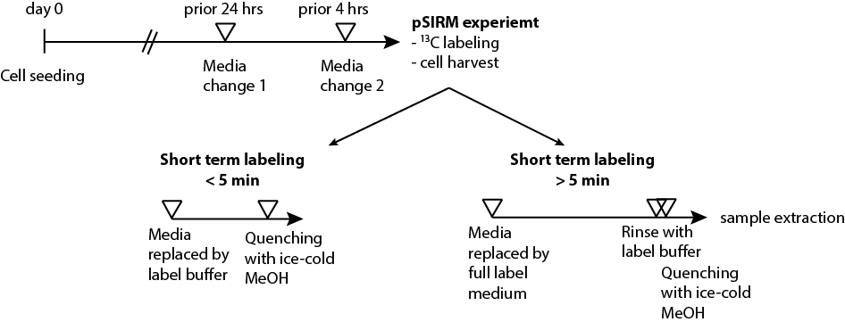

# pSIRM experiments{#psirm}

The application of stable isotopes provides a powerful tool to track the activity of metabolic pathways.
the time-dependent and atom-specific routing along a metabolic pathway resolved how substrates like glucose or glutamine are used in order to maintain a certain phenotype and energetic homeostatsis. 

We developed an approach called pulsed stable isotope resolved metabolomics (pSIRM) enabling the quantitative evaluation of metabolite pool sizes and incorporation of stable isotopes, e.g., $^{13}C_6$-glucose. A thoughtful setup of the experimental design including the applied substrates and carefull experimental handling are prerequisites for a successful pSIRM experiment. Essential aspects are collected in the below paragraphs along with a number of usefull tweaks.

## Experimental design

An *in vitro* pSIRM experiment lasts in total up to three days starting from the cell seeding at day zero. Further along the way up to two media changes should be included until the application of stable isotopes and harvesting the cells maintaining the continouse availability of nutrients and avoiding the accumulation of waste products (Figure \ref(fig:psirm)). The media change four hours prior the harvest is set up in order to give cells time to recover from the mechanical stress of the media change. At the time point of harvest cells should be in a perfect happily state regarding metabolic environment and stress. 

Choose carefully the _seeding density of you cells_ in the first place. High confluency inducing contact inhibition of cell growth has a strong impact on several cellular processes including the uptake of nutrients. Try to aim for petri dishes with a maximum confluency of 75-80 \%. A pre-experiment including different cell densities for seeding at a number of experimental conditions helps you to get a feeling for the cell growth in general and an expected output of cells at the time point of the harvest. Later one is useful to plan sample extraction and measurement subsequently.

```{r psirmexp, fig.cap="Experimental design of a pSIRM experiment distuingishing short and long labeling with stable isotopes.", echo=FALSE}

```

For adherent cell cultures only: Include for each experimental condition an additional petri dish that is solely used to determine the cell count at the time point of your harvest. This additional plate ensures a correct determination of absolute quantities and might reduce variation of pool sizes in the statistical analysis^[Pelleting these cells and snap-freezing might give usefull additional samples for western blotting.]. Think carefully about control conditions and include cell culture dishes that are not labeled. These dishes function as a control for your labeling procedure and the natural abundance of isotopes. 

## Experimental procedures

There is a slight difference in the protocols for [adherent](#psirm:adherent) and [suspension](#psirm:suspension) cells. Please read instructions and footnotes carefully.

Short^[I would rather recommend this up to 2 min of labeling] and long term labeling procured differ only in the applied solvents during the labeling - either label buffer ([LB](#washingbuffer)) only or a combination of full label medium (LM) and label buffer (LB). Latter one is applied in order to remove extracellular metabolites of the media. Both label buffer and media contain the major nutrients / stable isotopes to keep the main substrates at constant supply at all times (Table \@ref(tab:solvent)). During the application of stable isotopes longer than a few minutes cells might sense the absence of further intermediates provided during standard cell culture procedure and and adjust their metabolic program accordingly.

```{r solvent, echo = FALSE}
library(kableExtra)

tab = read.csv("tables/psirm_solvent.csv", TRUE)

knitr::kable(tab, booktabs = TRUE, caption = "Solvent composition of Full label medium (LM) and label buffer (BF) for a pSIRM experiment labeling with 13C-glucose.")
```

The quality of your data later heavily relies on the exact handling of the cells and a _consistent timing_ throughout the pSIRM experiment. Especially the step removing the LB and quenching the cells should be a matter of a tenth of seconds rather than seconds. It is of great value to perform the cell harvest with a second person.

## Protocol pSIRM
### Adherent cell cultures{#psirm:adherent}

The herein described protocols are detailed explanations how to perform a pSIRM cell harvest for long term label application. 
If you want to label for less than 2 minutes omit solely _omit steps 6-8_. 

Materials:

* Cell culture dishes, max. confluency 80 \%
* Labeling media (LM) supplemented with substrates (5 ml / dish)^[Not required for short term labeling] 
* Label buffer (LB) supplemented with substrates (5 ml / dish) 
* Ice-cold 50 \% MeOH supplemented with 2 ug/ul cinnamic acid
* 2x 5 ml pipette and tips^[Highly recommended, makes labeling and harvest super quick]
* Beaker
* Ice
* 15 ml falcons (chloroform resistant)
* Cell lifter
* Biological waste bin next to your bench

Procedure:

1. Pre-warm LB and LM in the water bath
2. Take a number of petri dishes (condition-wise including all biol. replicates)
3. Discard cell culture media
4. Carefully add _long term labeling_ LM OR _short term labeling_: LB
5. Incubate cells on the bench or in an incubator
6. Discard LM (beaker)
7. Add immediatly 5 ml of LB
8. Rotate dish once in order to cover complete surface
9. Meanwhile 2nd person get prepared with 5 ml ice-cold MeOH
10. Discard LB into beaker and _immediatly_ 2nd person quenches with ice-cold MeOH
11. Collect cell extracts using cell lifter
12. Transfer cell extracts into 15 ml falcons
13. Store falcons on ice until further processing

Repeat this procedure (step 6-10) for all dishes of a single condition first. Once MeOH is added metabolic processes are interrupted and cell extracts can be collected with the help of cell lifter without rush and subsequently transfered to 15 ml falcon and stored on ice until further processing (see chapter [Cell extraction methanolic extracts](#ccextraction_meoh)).

Determine the cell count using your additional petri dishes for each condition. 

### Supension cell cultures{#psirm:suspension}

Materials:

* Cell culture flasks
* Labeling media (LM) supplemented with substrates
* 5 ml pipette and tips^[Highly recommended, makes labeling and harvest super quick]
* 1 ml pipette
* Beaker
* paper tissues
* Liquid nitrogen
* 15 ml falcons
* 1.5 ml eppendorf tubes
* Biological waste bin next to your bench

Procedure:

1. Pre-warm LM in the water bath
2. Determine the cell count of your cell suspension(s)
3. Take aliquots of $10-15e+6$ cells and transfer into 15 ml falcon
4. Spin down cells very gently 300 g, 2 min at room temperature
5. Discard media into beaker
6. Resuspend cells gently in three-times 1 ml^[To generate three replicates]
7. Incubate and keep warm
8. Fractionate cell supension in three eppendorf tubes (3x 1 ml each)
9. Spin down quickly in top-bench centrifuge^[Most of the times 30 s are already enough] 
10. Discard media blandtly on paper tissues
11. Snap-freeze immediatly in liquid nitrogen
12. Store cells until further processing (see chapter [Cell extraction suspension cells](#ccextraction_susp))

The important step here to be quick is the alquotation of the cell suspension and subsequent spin down in the table centrifuge. Suspension cells are rather small, nevertheless $3e+6$ cells per extract are a good starting point for GC-MS measurements.

## Hints \& notes

* The only way to be reproducible and fast is to team up with a second person.
* Keep timing consistently through the experiment.
* Keep substrate concentrations constant throughout the experiment in all solutions.
* Supplement one stable isotopic labeled substrate with all remaining substrates in non-labeled form.
* Think about nutrient levels in your cell culture and your experimental conditions. Maybe you want to change things to physiological levels.
* Add additional plate to each condition in order to have material for western blotting and others.
* Check carefully the confluency of your dishes and determine seeding densities for different conditions.
* In case of small molecule inhibitors: Try to avoid to solve them in DMSO - strong impact on chromatography.
