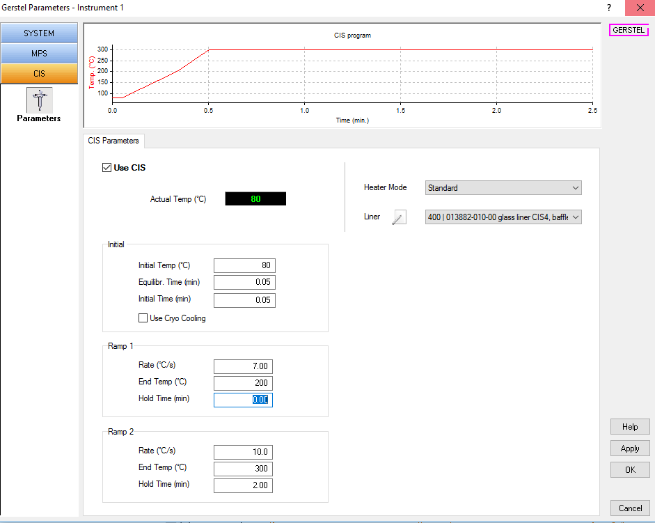
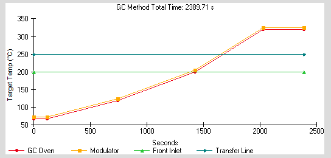

# GC-MS settings{#gcms}

In the following paragraphs details of GC-MS settings are described in detail. The herein described settings have been optimized for cell extracts measured in split-mode 1:5 on the instrument Pegasus 4D-C GC-ToF-MS in 1D mode equiped with an autosampler Gerstel MPS.

### Autosampler settings

The table \@ref(tab:gerstel) summarises the defined parameter for method settings of the Gerstel MPS.

```{r gerstel, echo=FALSE}

mps = read.csv("tables/mps_settings.csv", TRUE)

#knitr::kable(mps, booktabs = TRUE, caption = "Parameter of Gerstel MPS settings")
# 
knitr::kable(mps, booktabs = TRUE, caption = "Parameter of Gerstel MPS settings") %>%
   kable_styling() %>%
   group_rows(index = c("System" = 3, 
                       "MPS Liq. Inj." = 15,
                        "MPS Rinse" = 8))
  

```

The injector itself is a temperature-regulated system providing the advantage of a focused injection of the sample. Gradient 

```{r cis, fig.cap="Settings temperature-regulated injection for Gerstel MPS", echo=FALSE, fig.width=6}



```


### Gas chromatography

The most important settings of the GC method are listed below. A graphical representation of the gradient in the oven is shown in figure \@ref(fig:gradient) and corresponding values in table \@ref(tab:gradient2).

Flow path:

1. Inlet: Front
2. Capillary: GC Oven 50 m, 250 u int. diameter, 0.25 u film thickness, RTX-5 phase
3. Capillarty: Detector 0.21 m, 250 u int. diameter, 0.25 u film thickness, RTX-5 phase
4. Detector: TOF


```{r gc, echo=FALSE}

mps = read.csv("tables/gc_settings.csv", TRUE)

#knitr::kable(mps, booktabs = TRUE, caption = "Parameter of Gerstel MPS settings")
# 
knitr::kable(mps, booktabs = TRUE, caption = "Parameter of Gerstel MPS settings") %>%
   kable_styling() %>%
   group_rows(index = c("System" = 2, 
                       "Front Inlet" = 5,
                        "Oven" = 3))
  

```


```{r gradient, echo=FALSE, fig.cap="GC gradient - graphical representation. Rate in (&deg;C/min), Target temperature in (&deg;C), Duratin in (min)."}


```

```{r gradient2, echo=FALSE}

grad = data.frame(Rate = c("Initial", 5, 7, 12),
                  Target_Temp = c(68, 120, 200, 320),
                  Duration = c( 2, 0, 0, 6))

kable(grad, booktabs = TRUE, caption = "GC gradient profile - Rate shown in (K/min), Target Temp in (&deg;C), Duration in (min)")

```

### Mass spectrometer settings

```{r ms, echo=FALSE}

mps = read.csv("tables/ms_setting.csv", TRUE)

#knitr::kable(mps, booktabs = TRUE, caption = "Parameter of Gerstel MPS settings")
# 
knitr::kable(mps, booktabs = TRUE, caption = "Parameter of Gerstel MPS settings") %>%
   kable_styling() %>%
   group_rows(index = c("Filament" = 4, 
                       "Mass detection" = 7,
                        "Ion source" = 3))
  

```


